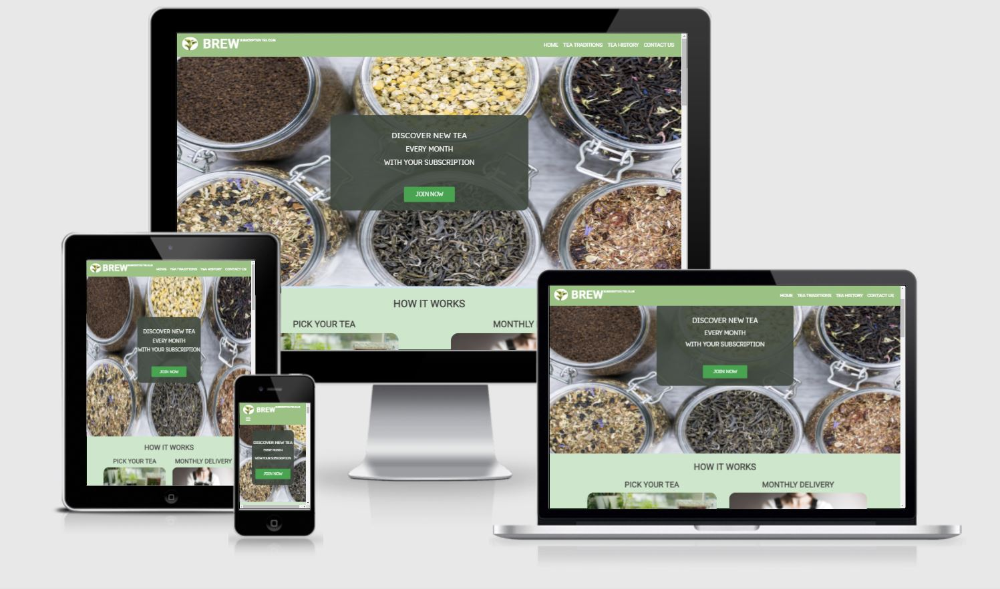
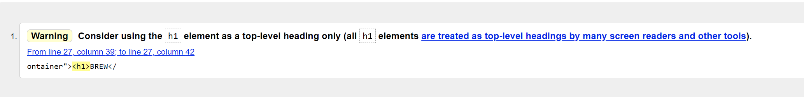
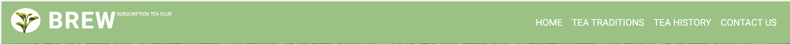
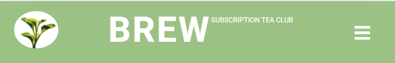
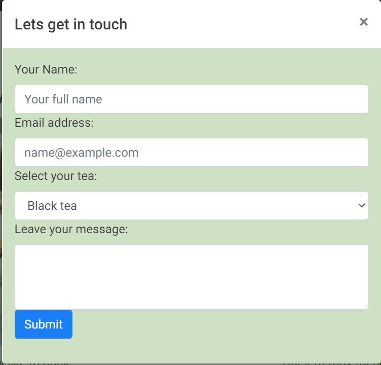
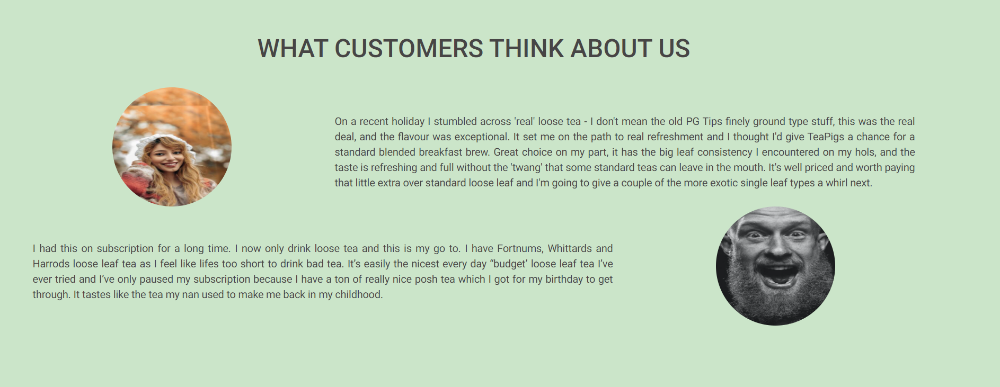
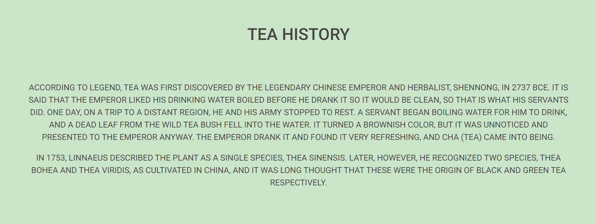
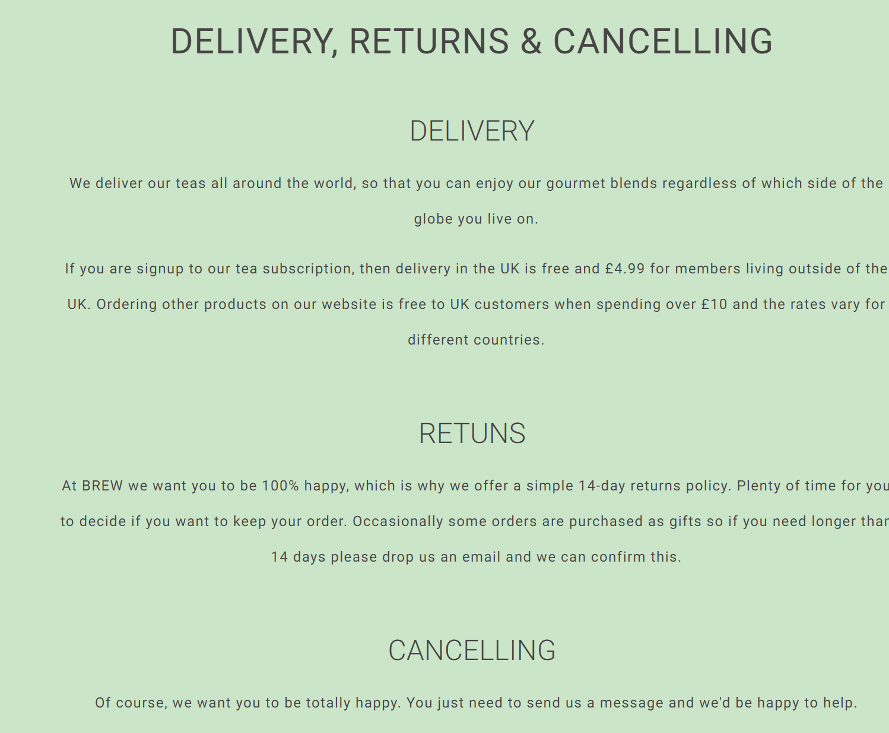

  
    
# Milestone 1 project    
 ## [Live website on github pages](https://alexandergrib.github.io/ms1/)    
   
  
---  
# Table of contents 
- [Introduction](#INTRODUCTION)
- [UX](#ux)    
  - [Website owner business goals](#website-owner-business-goals)    
  - [User goals](#user-goals)    
  - [User stories](#user-stories)    
  - [Structure of the website](#structure-of-the-website)    
  - [Wireframes](#Wireframes)    
  - [Surface](#surface)    
- [Features](#features)    
  - [Existing features](#existing-features)  
  - [Features left to implement](#Features-left-to-implement)  
- [Technologies used](#technologies-used)       
- [Testing](#testing)        
- [Deployment](#deployment)    
- [Bugs](#bugs)  
   - [Problems encountered](#problems-encountered)  
- [Credits](#credits)    
    

# INTRODUCTION

This website is built for the private tea shop, which offering tea delivery by subscription service.
Website feature different variety of tea to choose from, as well as some useful information to user, such as tea history and tea drinking traditions.
Website offers clean and structured design, allowing user easy and intuitive navigation.
    
# UX    

 ## Website owner business goals 

 - As the site owner of this imaginary teashop, I want to deliver clean and easy to read information about different types of tea that exist in the world.  Tea varieties offered on the website are green, black, white and pu’er teas. 
 - As a business I want to give opportunity to my visitors to personally try different types of tea by getting in touch with us through the contact form.    Also, I would like to help customers learn more about how tea is grown, how it processed and delivered around the globe and end up in their morning cup of tea.    
  
  
  
## User goals

- As a user I want to have easy navigation and intuitive navigation through the website   
- Simplicity of reading headlines and have a clear view of pictures    
- Ability to navigate between pages and possibility to return to the home page whiting one click    
- Site must be readable under all screen sizes, must include mobile (in my case it would be Samsung s8), and it should work with tablet screen and under high-res desktop screen    
- Website should contain media gallery inside picture snippets with rounded edges and light border, with a possibility to scroll itself    
    
    
## User stories 

### As a business owner: 

- I want to provide in-depth information about the products I offer through  click-in option on product images    
- To place an order and enquire further about the subscription user should fill out  “Contact me” form.    
    
    
    
### As a new customer: 

- As a user, I want to have easy and intuitive navigation through the website  
- As a user, I want to be able easily access contact details   
- As a user, I want to see relevant information about products offered on the website  
- As a user, I want to see reviews about products offered which would help me make my decision about specific item I may be interested.  
- As a user, I want to find out more about how tea was discovered  
- As a user, I want to have option to stop subscription if I wish to
 
---
   
# Structure of the website 

The website is set up to be used on as many devices as possible, this includes small mobile phones as well as extra-large 4k tv screens. Website has to be easy to navigate between sections by clicking required link in the navigation bar. Also includes easily accessible "contact me" form with acknowledgement message after completing and send.    
There are small differences on some pages between mobile and desktop, to have a better visualization of the content, based on the device.     
    
# Wireframes 

Wireframes can be found here:  

 [Desktop](wireframes/desktop.png)  
 [Tablet](wireframes/tablet.png)  
 [Mobile](wireframes/mobile.png)  
 
 ---
 
 # Surface 
 
  ## Fonts
  
  I decided to go with Google Roboto font and sans-serif as a fallback font.    
I think Roboto font is a most used font across whole internet, and it would not look too different for the user coming from any website they used to use.  This will create a more familiar feeling for the users.  
    
    
## Colors 

Trying to keep whole webpage in harmonic design and have it associated with “tea” colours, I decided to go for the light green colour for the header and footer and to keep it contrasted but organic in colour I went for the blue-ish for the background. To keep high contrast for the text I set colour to white with black shadow outline.    
I used following colours:    
- Body background color: #C6E7C6    
- jumbotron color: #215020  
- Headings color: #474545  
- Text color: #474545    
- Background color header and footer: #93C47D  
    
    
## Images 

- All images on the website was taken from internet resources with all credit information stated in "Credits" section of this README file.    
    
## Text 

- While I tried to keep my website filled with useful information, I have had to copy some text mainly from Wikipedia page. Most text information is credited in “Credits” section in this README file     
    
# Features 

The website is a single page with interactive links to sections on the page with popup window with send me a message form.    
    
## Existing Features 

### Navigation Bar (in the Header): 

- Visible on all pages and attached to the top of the page    
- Mobile view collapses links into “Burger menu”     
- Left side of navigation bar contains Logo image with active link to homepage    
- Right side of navigation bar contain 4 hyperlinks:    
  - Home    
  - Tea traditions(gallery)    
  - Tea History    
  - Contact me (modulo popup with email and textbar)    
    
    
    
### Footer: 

- Visible on all pages     
- Contain contact up link    
- Imaginary business address information    
- Fontawesome icons with links to default home page of linkedin, facebook, githup    
- Copyright information    
    
    
### Home (index.html): 

- Introduction text for what the website is about    
- Clickable Pictures with tea icon    
  - black tea page    
  - green tea page    
  - white tea page    
  - puer tea page    
- Picture gallery    
- History section    
- Customer reviews section    
- About us section    
    
    
    
### Contact form (contact.html): 

- Required form fields: Name, Email address, tea selection and Message  fields  
- On submit, "thank you" alert message will be shown (submit form send information to CI server to display values sent)   
    

## Features left to implement
 
- Add handler to perform action on "subscribe now" button
- Add payment handling system
- Create user dashboard where users can manage their subscriptions

    
## Technologies used 

- HTML
- CSS    
- Bootstrap    
- Fontawesome    
- Google Fonts      
- Github    
- Git    
- Balsamiq    
- [Trello](https://trello.com/b/AimOKUHW/ms1-project) for KANBAN project organizing  
    

---

# Testing 

### HTML W3 code validator

All pages were tested.

W3 HTML validator displaying 1 error message:
> Consider using the `h1` element as a top-level heading only

This error appear because my h1 element is wrapped inside div element. It's done to position elements properly.

###  W3C CSS validator
All pages were tested.
No error are detected.

## Google chrome developers tool

### Mobile  
- Functionality testing – I used Google chrome developers tools to test different screens responsiveness of webpages, as well on actual mobile phone and large screen monitor.    
- Code Validation – Lighthouse(google dev tools)    
     
- Issues found during site development – see section problems encountered    
- Performance testing Lighthouse(google dev tools)    
  - Performance score: 81  (lower score due to loading external bootstrap scripts, and some images are slightly on the larger side)  
  - Accessibility score: 96  
  - Best Practices score 93  
    
### Desktop  

- Performance testing Lighthouse(google dev tools)    
  - Performance score: 99    
  - Accessibility score: 93  
  - Best Practices score 93  
  
---
## Responsiveness testing
 - Tested in Google Chrome, Mozilla, Edge browsers in full screen mode
   - [Full screen view](assets/img/responcivness_full.png)
 - Adjusted screen to 1024px(Ipad pro)
   - [1024px](assets/img/responcivness_1024.png)
 - Adjusted screen to 320px. This screen size have an issue displaying in Google Chrome, it but looks better in mozilla
   - [Chrome-320px](assets/img/responcivnes_320px.png),
   - [Mozzilla-320px](assets/img/responcivness-320-moz.png)
   - After changing Bootstrap columns setup pictures are displayed correctly [320px chrome](assets/img/320px_responsiveness.png)

  # User stories testing
  
  Each user stories tested throughout website
> As a user, I want to have easy and intuitive navigation through the website  
  
  Navigational bar is implemented into website, so any customer is able to access relative information quick and easy.
   Navigational bar on Medium and Large screens:
  
  
Navigational bar on Medium and Small screens:

>  As a user, I want to be able easily access contact details

Contact us form is implemented.

> As a user, I want to see relevant information about products offered on the website

Implemented description how to order, what customer will receive and selection of choices to pick from.

>  As a user, I want to see reviews about products offered which would help me make my decision about specific item I may be interested.

Implemented "what customers think about us" section displaying reviews on home page

> As a user, I want to find out more about how tea was discovered

Implemented history section:

> As a user, I want to have option to stop subscription if I wish to

Implemented Delivery and Returns page giving cistomer information about delivery and cancellations

---

  ## Manual testing
  Throughout the website every link, button, icon and image was tested and all results are displayed in the table below:
  
| Location | Type | Expected Result | Actual Result | Pass/Fail |
| :----: | :----: | :----: | :----: | :----: |
| Header | Logo icon | *Click* on **Logo** Navigates to home page | Navigates to home page | Pass |
| Header | HOME link | *Click* on **HOME** link Navigates to home page | Navigates to home page | Pass |
| Header | TEA TRADITIONS link | *Click* on **TEA TRADITIONS** link Navigates to TEA DRINKING TRADITIONS section | Navigates to TEA DRINKING TRADITIONS section | Pass |
| Header | TEA HISTORY link | *Click* on **TEA HISTORY** link Navigates to TEA DRINKING TRADITIONS section | Navigates to TEA HISTORY section  | Pass |
| Header | Contact us link | *Click* on **CONTACT US** link open modulo with form where user can submit message | Modulo displayed correctly | Pass |
| Home page | JOIN NOW button | *Click* on **JOIN NOW** button to open modulo with form where user can submit message | Modulo displayed correctly | Pass |
| Home page/SELECT YOUR TEA section | BLACK TEA Link | *Click* on **BLACK TEA** navigates to *domain*/black.html| Navigates to *domain*/black.html | Pass |
| Home page/SELECT YOUR TEA section | GREEN TEA Link | *Click* on **GREEN TEA** navigates to *domain*/green.html| Navigates to *domain*/green.html | Pass |
| Home page/SELECT YOUR TEA section | WHITE TEA Link | *Click* on **WHITE TEA** navigates to *domain*/white.html| Navigates to *domain*/white.html | Pass |
| Home page/SELECT YOUR TEA section | PU'ER TEA Link | *Click* on **PU'ER TEA** navigates to *domain*/puer.html| Navigates to *domain*/puer.html | Pass |
| Home page / TEA DRINKING TRADITIONS | Image carousel | Displaying images/ *Click* on next/previous arrows change slide | Displaying images, next/previous arrows changes slide | Pass |
| Footer | Homepage link | *Click* on **Homepage** link Navigates to Homepage  | Navigates to home page | Pass |
| Footer | Traditions link | *Click* on **Traditions** link Navigates to TEA DRINKING TRADITIONS  section | Navigates to TEA DRINKING TRADITIONS section | Pass |
| Footer | History link | *Click* on **History** link Navigates to HISTORY  section | Navigates to HISTORY section | Pass |
| Footer | Delivery and Returns link | *Click* on **Delivery and Returns** link navigates to *domain*/delivery.html | Navigates to *domain*/delivery.html | Pass |
| Footer | Facebook icon | *Click* on **Facebook** icon open Facebook website on the new page  | Open new page with Facebook | Pass |
| Footer | LinkedIn icon | *Click* on **LinkedIn** icon open LinkedIn website on the new page  | Open new page with LinkedIn | Pass |
| Footer | GitHub icon | *Click* on **GitHub** icon open GitHub website on the new page  | Open new page with GitHub | Pass |
| Contact us modulo | Input field | Name/Email address require field to be filled, otherwise will display error | *Click* submit with Name/Email empty fields with displayed *Please fill out this field* | Pass |
| Contact us modulo | Submit button | *Click* submit button with correctly filled fields redirects to *Code Institute form response page* | Redirected to *Code Institute form response page*  | Pass |
| *domain*/black.html | <HOME PAGE/ GREEN TEA> button-link | *Click* on GREEN TEA button redirects to  *domain*/green.html | Redirected to  *domain*/green.html  | Pass |
| *domain*/green.html | <BLACK TEA / WHITE TEA> button-link | *Click* on WHITE TEA button redirects to  *domain*/white.html | Redirected to  *domain*/white.html  | Pass |
| *domain*/white.html | <GREEN TEA / PU'ER TEA> button-link | *Click* on PU'ER TEA button redirects to  *domain*/puer.html | Redirected to  *domain*/puer.html  | Pass |
| *domain*/puer.html | <WHITE TEA button-link | *Click* on WHITE TEA button redirects to  *domain*/white.html | Redirected to  *domain*/white.html  | Pass |

---

# Deployment

## Deploying on GitHub Pages
 1.  Log into  [GitHub](https://github.com/)  or  [create an account](https://github.com/).
2.  Locate the  [GitHub Repository](https://github.com/alexandergrib/ms1).
3.  At the top of the repository, select Settings from the menu items.
4.  Scroll down the Settings page to the "GitHub Pages" section.
5.  Under "Source" click the drop-down menu labelled "None" and select "Master Branch".
6.  Upon selection, the page will automatically refresh meaning that the website is now deployed.
7.  Scroll back down to the "GitHub Pages" section to retrieve the deployed link.

## Forking the Repository

1.  Log into  [GitHub](https://github.com/)  or  [create an account](https://github.com/).
2.  Locate the  [GitHub Repository](https://github.com/alexandergrib/ms1).
3.  At the top of the repository, on the right side of the page, select "Fork".
4.  You should now have a copy of the original repository in your GitHub account.
    
## How to run this project within a local IDE, such as Pycharm/VScode

1.  Log into  [GitHub](https://github.com/)  or  [create an account](https://github.com/).    
2.  Locate the  [GitHub Repository](https://github.com/alexandergrib/ms1).    
3.  Under the repository name, click "Clone or download".    
4.  In the Clone with HTTPs section, copy the clone URL for the repository.    
5.  In your local IDE open the terminal.    
6.  Change the current working directory to the location where you want the cloned directory to be made.    
7.  Type 'git clone', and then paste the URL you copied in Step 3.    
    > git clone  [https://github.com/USERNAME/REPOSITORY](https://github.com/USERNAME/REPOSITORY)
        
8.  Press Enter. Your local clone will be created.
    

Further reading and troubleshooting on cloning a repository from GitHub  [here](https://docs.github.com/en/github/creating-cloning-and-archiving-repositories/cloning-a-repository). 

---
  

 # Bugs  
  
  ### Problems encountered: 

- Git merging branch with local Pycharm. "The “fatal: refusing to merge unrelated histories” Git error"    
  - resolved by applying <code>git pull origin master --allow-unrelated-histories</code>    
- Issue with text overflowing boundaries of jumbotron    
  - Added :before and :after css to break line in exact place where intended, and reduced size of the text on small screen [solution](https://www.educative.io/edpresso/how-to-add-a-line-break-using-css)    
- customer images change shape from circe to oval on small screen sizes    
  - fixed by adding @media query to resize image    
- Navigation bar not collapsing back    
  - fixed by adding script at the bottom of the body [solution found here](https://stackoverflow.com/questions/28472815/bootstrap-navbar-collapse-not-closing-on-click)    
- Image on the tea page have text overlapping image  
   - fixed by setting image height and width to responsive instead of fixed values  
- Issue with alignment of columns in footer section    
  - Added div container around row, this helped to squeeze columns bit closer to the center. (Tutor Assisted with solution)  
    
- Headers are hiding under navbar when link to sections are clicked      
  - Wrapped section in div and set padding top in css. (Tutor Assisted with solution)  
- Some images overflowing  screen in small resolution (320px)
    - [320px image overflowing](assets/img/responcivness_bug_320px.png)
    - Fixed by replacing container columns from col-auto to (col-12, col-md-6)
    
- Footer displayed incorrectly in some cases
    - [footer bug](assets/img/footer_bug_mobile.png)
    - need to find solution on this issue. 
    
- Issue with horizontal scroll appearing some times, this issue is intermittent, and i cannot find what causing it, on refresh this issue goes away.

---
  
# Credits   

## Credits for text and modules  

Skeleton structure of the README.md file was copied from [Jacqueline Kraus](https://github.com/jacqueline-kraus/MS1-Discover-NZ)    
Most of my text and educative information was copied from Wikipedia    
- [bootstap carousel](https://getbootstrap.com/docs/4.0/components/carousel/)  
- [Reviews text](https://amazon.co.uk)   
- [headlines for hero paragraphs](https://theteahouseltd.com/)    
- [text shadows example](https://www.codesdope.com/blog/article/adding-outline-to-text-using-css/)    
- [Traditions text](https://www.mentalfloss.com/article/72891/15-tea-traditions-around-world#:~:text=Drinking%20tea%20is%20a%20tradition,preparations%20evolving%20along%20the%20way.)    
- [Tea history](https://en.wikipedia.org/wiki/History_of_tea_in_China)    
- [tea facts](https://www.healthline.com/nutrition/top-10-evidence-based-health-benefits-of-green-tea#4.-Antioxidants-may-lower-the-risk-of-some-cancers)    
- [black tea page](https://www.lipton.com/us/en/world-of-tea/how-to-brew-black-tea.html)    
- [Green tea page](https://coffeeandteacorner.com/adding-honey-to-green-tea/#:~:text=Final%20thoughts-,So%20can%20you%20add%20honey%20to%20green%20tea%20%3F,keep%20its%20health%2Dimproving%20properties.)    
    
 
    
## Credits for images used:    
- Hero background  Photo by <a href="https://unsplash.com/@procaffeinator?utm_source=unsplash&utm_medium=referral&utm_content=creditCopyText">Arfan Abdulazeez</a> on [Hero img](https://unsplash.com/photos/oi0FvNhkHy8)    
 - Black tea img Photo by <a href="https://unsplash.com/@og?utm_source=unsplash&utm_medium=referral&utm_content=creditCopyText">Oleg Guijinsky</a> on <a href="/collections/1564860/tea?utm_source=unsplash&utm_medium=referral&utm_content=creditCopyText">Unsplash</a> [black tea](https://unsplash.com/photos/2CRgKZAyPXg)    
 - Mixed tea Photo by <a href="https://unsplash.com/@stri_khedonia?utm_source=unsplash&utm_medium=referral&utm_content=creditCopyText">Alice Pasqual</a> on <a href="/s/photos/gree-tea?utm_source=unsplash&utm_medium=referral&utm_content=creditCopyText">Unsplash</a> [mixed tea](https://unsplash.com/photos/xdD-x2Y2SPI)    
 - Mixed 2  Photo by <a href="https://unsplash.com/@stri_khedonia?utm_source=unsplash&utm_medium=referral&utm_content=creditCopyText">Alice Pasqual</a> on <a href="/s/photos/gree-tea?utm_source=unsplash&utm_medium=referral&utm_content=creditCopyText">Unsplash</a> https://unsplash.com/photos/59Kh3TAajg0    
 - Tea leaves Photo by <a href="https://unsplash.com/@newmanphotog?utm_source=unsplash&utm_medium=referral&utm_content=creditCopyText">Timothy Newman</a> on <a href="/s/photos/gree-tea?utm_source=unsplash&utm_medium=referral&utm_content=creditCopyText">Unsplash</a> https://unsplash.com/photos/_ZH-GRbh0iE    
 - Green tea Photo by <a href="https://unsplash.com/@teacreative?utm_source=unsplash&utm_medium=referral&utm_content=creditCopyText">Tea Creative │ Soo Chung</a> on <a href="/s/photos/green-tea?utm_source=unsplash&utm_medium=referral&utm_content=creditCopyText">Unsplash</a> https://unsplash.com/photos/SpnGFRf0Nmk    
 - White tea By <a href="https://en.wikipedia.org/wiki/User:Iateasquirrel" class="extiw" title="en:User:Iateasquirrel">Iateasquirrel</a>, <a href="http://creativecommons.org/licenses/by-sa/3.0/" title="Creative Commons Attribution-Share Alike 3.0">CC BY-SA 3.0</a>, <a href="https://commons.wikimedia.org/w/index.php?curid=553061">Link</a>    
 - Puer tea <a href="http://creativecommons.org/licenses/by-sa/3.0/" title="Creative Commons Attribution-Share Alike 3.0">CC BY-SA 3.0</a>, <a href="https://commons.wikimedia.org/w/index.php?curid=603774">Link</a>    
 - Teacup Photo by <a href="https://unsplash.com/@teacora?utm_source=unsplash&utm_medium=referral&utm_content=creditCopyText">TeaCora Rooibos</a>  
 - Tea tradition 1 Photo by <a href="https://unsplash.com/@lauraadaiphoto?utm_source=unsplash&utm_medium=referral&utm_content=creditCopyText">laura adai</a>  
 - Tea tradition 2 Photo by <a href="https://unsplash.com/@igorstarkoff?utm_source=unsplash&utm_medium=referral&utm_content=creditCopyText">Igor Starkov</a>  
 - Tradition 3 Photo by <a href="https://unsplash.com/@pursuit_of_shutter?utm_source=unsplash&utm_medium=referral&utm_content=creditCopyText">Ranit Chakraborty</a>  
 - Tradition 4 Photo by <a href="https://unsplash.com/@teacreative?utm_source=unsplash&utm_medium=referral&utm_content=creditCopyText">Tea Creative │ Soo Chung</a>  
 - Face 1 Photo by <a href="https://unsplash.com/@omidarmin?utm_source=unsplash&utm_medium=referral&utm_content=creditCopyText">Omid Armin</a>  
 - Face 2 Photo by <a href="https://unsplash.com/@krivitskiy?utm_source=unsplash&utm_medium=referral&utm_content=creditCopyText">Alexander Krivitskiy</a>  
 - Black tea Photo by <a href="https://unsplash.com/@hectorfalcon?utm_source=unsplash&utm_medium=referral&utm_content=creditCopyText">Hector Falcon</a>    
 - Green tea photo by <a href="https://unsplash.com/@whatam1?utm_source=unsplash&utm_medium=referral&utm_content=creditCopyText">Arseniy Kapran</a>    
 - White tea Photo by <a href="https://unsplash.com/@toma_sh?utm_source=unsplash&utm_medium=referral&utm_content=creditCopyText">Tamara Schipchinskaya</a>  
 - Puer tea Photo by <a href="https://unsplash.com/@oriento?utm_source=unsplash&utm_medium=referral&utm_content=creditCopyText">五玄土 ORIENTO</a>   
 - Tea box Photo by <a href="https://unsplash.com/@faisaldada?utm_source=unsplash&utm_medium=referral&utm_content=creditCopyText">Faisal</a> on <a href="https://unsplash.com/s/photos/tea-box?utm_source=unsplash&utm_medium=referral&utm_content=creditCopyText">Unsplash</a>  
 - Parcel Photo by <a href="https://unsplash.com/@kadh?utm_source=unsplash&utm_medium=referral&utm_content=creditCopyText">Kira auf der Heide</a> on <a href="https://unsplash.com/collections/1931647/vuurvlieg?utm_source=unsplash&utm_medium=referral&utm_content=creditCopyText">Unsplash</a>
 - Background image Photo by <a href="https://unsplash.com/@stri_khedonia?utm_source=unsplash&utm_medium=referral&utm_content=creditCopyText">Alice Pasqual</a> on <a href="https://unsplash.com/photos/2yZxFxn1938">Unsplash</a>
  